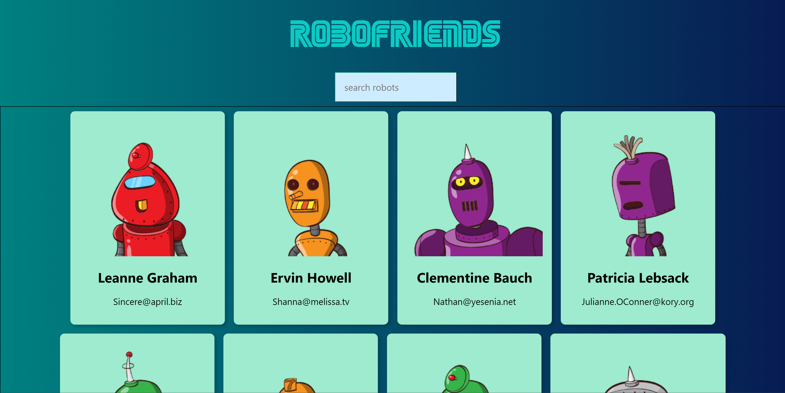

# Robo Friends

A responsively-designed React app that can search between different API generated robots.

## Tech Stack

**Front-End:** HTML, CSS, JavaScript, React

**React Packages:** Create React, Tachyons

**API:** RoboHash, JSONPlaceholder

## Installation

1) Clone this repo
2) Change your directory : cd robo-friends
3) Run npm install
4) Run npm start
5) open http://localhost:3000 to view it in the browser.

## Demo

